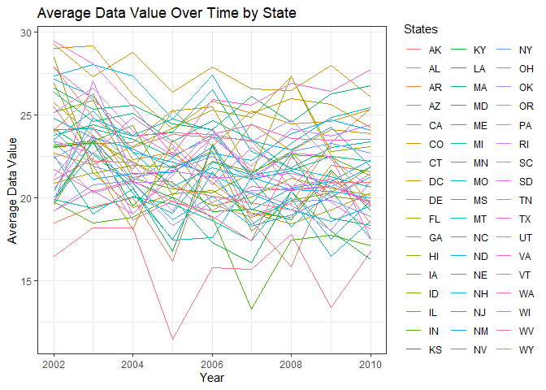

p8105_hw3_bp2678
================
Brady Pham
2023-10-12

``` r
library(tidyverse)
```

    ## ── Attaching core tidyverse packages ──────────────────────── tidyverse 2.0.0 ──
    ## ✔ dplyr     1.1.3     ✔ readr     2.1.4
    ## ✔ forcats   1.0.0     ✔ stringr   1.5.0
    ## ✔ ggplot2   3.4.3     ✔ tibble    3.2.1
    ## ✔ lubridate 1.9.2     ✔ tidyr     1.3.0
    ## ✔ purrr     1.0.2     
    ## ── Conflicts ────────────────────────────────────────── tidyverse_conflicts() ──
    ## ✖ dplyr::filter() masks stats::filter()
    ## ✖ dplyr::lag()    masks stats::lag()
    ## ℹ Use the conflicted package (<http://conflicted.r-lib.org/>) to force all conflicts to become errors

``` r
library(dplyr)
library(ggplot2)
```

\#QUESTION 2

``` r
library(p8105.datasets)
data("brfss_smart2010")
```

``` r
brfss_smart2010_df = brfss_smart2010 |>
  janitor::clean_names() |>
  rename(States = locationabbr,
          County = locationdesc) |>
  filter(response %in% c("Excellent", "Very Good", "Good", "Fair", "Poor")) |>
  filter(topic == "Overall Health") |>
  mutate(
    response = factor(response, levels = c("Poor", "Fair", "Good", "Very Good", "Excellent"),
                      ordered = TRUE)) |>
  arrange(response)
```

I renamed the variables like locationabbr to “States” and locationdesc
to “County”. I also organized the responses from poor to excellent where
poor starts first. Addtionally, I filter the responses in topic where it
is “overall health”.

``` r
newdataset_2002 <- 
  brfss_smart2010_df |>  
  filter(year == "2002")

answer_2002 <- newdataset_2002 |> 
  count(States) |>  
  filter(n >= 7)
answer_2002
```

    ## # A tibble: 36 × 2
    ##    States     n
    ##    <chr>  <int>
    ##  1 AZ         8
    ##  2 CO        16
    ##  3 CT        28
    ##  4 DE        12
    ##  5 FL        28
    ##  6 GA        12
    ##  7 HI        16
    ##  8 ID         8
    ##  9 IL        12
    ## 10 IN         8
    ## # ℹ 26 more rows

There are 36 states that were visted more than 7 times in 2002

``` r
newdataset_2010 <- 
  brfss_smart2010_df |>  
  filter(year == "2010")

answer_2010 <- newdataset_2010 |> 
  count(States) |>  
  filter(n >= 7)
answer_2010
```

    ## # A tibble: 45 × 2
    ##    States     n
    ##    <chr>  <int>
    ##  1 AL        12
    ##  2 AR        12
    ##  3 AZ        12
    ##  4 CA        48
    ##  5 CO        28
    ##  6 CT        20
    ##  7 DE        12
    ##  8 FL       164
    ##  9 GA        16
    ## 10 HI        16
    ## # ℹ 35 more rows

There are 45 states that were visted more than 7 times in 2010

Making the Graph

``` r
Excellent_only <- brfss_smart2010_df |>
  filter(response == "Excellent") |>
  group_by(year, States) %>%
  summarize(avg_data_value = mean(data_value, na.rm = TRUE)) |>
  ungroup()
```

    ## `summarise()` has grouped output by 'year'. You can override using the
    ## `.groups` argument.

``` r
ggplot(Excellent_only, aes(x = year, y = avg_data_value, group = States, color = States)) +
  geom_line() +
  labs(title = "Average Data Value Over Time by State",
       x = "Year",
       y = "Average Data Value") +
  theme_minimal()
```

<!-- -->

Made newyork graph

``` r
NewYork_only <- brfss_smart2010_df |>
  filter(States == "NY", year %in% c(2006, 2010), response %in% c("Poor", "Fair", "Good", "Very Good", "Excellent"))

ggplot(NewYork_only, aes(x = response, y = data_value)) +
  geom_boxplot() +
  facet_grid(. ~ year, scales = "free") +
  labs(title = "Distribution of Data Value in NY State by Response",
       x = "Response",
       y = "Data Value") +
  theme_minimal()
```

<!-- -->

\#Question 3

``` r
nhanes_accel_df = 
  read_csv("DATA/nhanes_accel.csv",) |>
  janitor::clean_names() 
```

    ## Rows: 250 Columns: 1441
    ## ── Column specification ────────────────────────────────────────────────────────
    ## Delimiter: ","
    ## dbl (1441): SEQN, min1, min2, min3, min4, min5, min6, min7, min8, min9, min1...
    ## 
    ## ℹ Use `spec()` to retrieve the full column specification for this data.
    ## ℹ Specify the column types or set `show_col_types = FALSE` to quiet this message.

``` r
  nhanes_covar_df = 
  read_csv("data/nhanes_covar.csv", skip = 4) |>
  janitor::clean_names() |>
  mutate(
    sex = recode(
      sex,
      `1` = "male",
      `2` = "female")) |>
  mutate(
  education = recode(
    education,
    `1` = "less than high school",
    `2` = "high school equivalent",
    `3` = "more than high school"))
```

    ## Rows: 250 Columns: 5
    ## ── Column specification ────────────────────────────────────────────────────────
    ## Delimiter: ","
    ## dbl (5): SEQN, sex, age, BMI, education
    ## 
    ## ℹ Use `spec()` to retrieve the full column specification for this data.
    ## ℹ Specify the column types or set `show_col_types = FALSE` to quiet this message.
